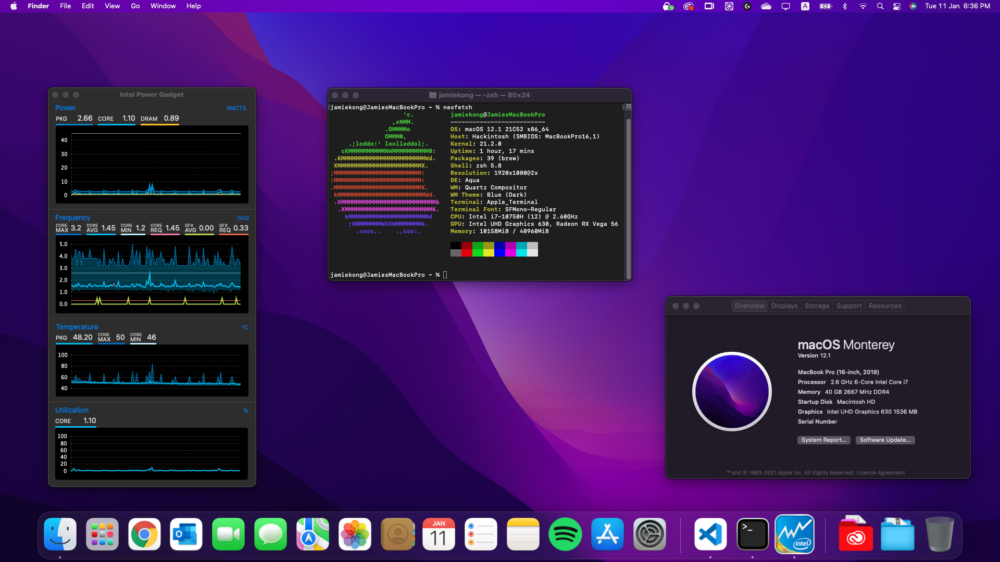

# Dell Inspiron 7501 Hackintosh

    

## If you are still here, I would really like to thank you for your support even though I have not updated this repo for more than half a year. I hope there is better to come!

## System configuration

| Model     | MacBookPro16,1      | Version        | Catalina 10.15.7/Big Sur 11.1/Monterey 12.1      |
| :-------- | :------------------ | :------------- | :------------------ |
| Processor | Intel Core i7-10750H | Graphics       | UHD Graphics 630    |
| Memory    | 2993MHz DDR4 1x8GB + 2666MHz 1x32GB  | OS Disk        | LiteOn CL1-3D512-Q11 NVMe (included with laptop, models with SK Hynix PC711 not supported.) |
| Audio     | Realtek ALC236 (Speaker + HP Jack + Sleep working from custom AppleALC.kext)      | WiFi/Bluetooth | Dell DW1560 (swapped)/Intel AX201(default card)|

## About build

- My neofetch shows Intel UHD Graphics 630, Radeon RX Vega 56, which is because eGPUs are supported! I have connected a Blackmagic EGPU Pro. 

#### Performance

- [Geekbench 5](https://browser.geekbench.com/v5/cpu/4411543): 1097 SingleCore, 4244 MultiCore
- Battery: 48wh with 50% brightness (2 NVMe), I got 2.5h ish screen time when surfing the web and using OneNote/VSCode

#### Not Working

- Things that may never work:
  - Discrete GPU (Disabled)
  - Fingerprint (Disabled)
  - Internal and Combo Jack Microphone
  - HDMI Port (USB-C works)

## Installation

### BIOS

- Disk in `AHCI` mode
- Fastboot: `Thorough`
- Secure Boot `Disabled`

### STEP

> You can follow [Dortania's guide](https://dortania.github.io/OpenCore-Install-Guide/) as it is very detailed and easy to understand.

#### TL;DR

- Prepare an Mac installer in USB with [macrecovery](https://dortania.github.io/OpenCore-Install-Guide/installer-guide/)
- Go to the [releases](https://github.com/jamieernest/Dell-Inspiron-7501-Hackintosh/releases) and download the lastest version
- Replace EFI folder in USB EFI partition with the EFI folder from the zip file
- If you are using Intel wifi go to [Dell-Inspiron-7501-Hackintosh/Intel Wifi](https://github.com/jamieernest/Dell-Inspiron-7501-Hackintosh/tree/master/Intel%20Wifi/) select the correct folder for the MacOS version you are installing and copy the kexts to EFI/OC/Kexts and do the same, but from [the Broadcomm folder](https://github.com/jamieernest/Dell-Inspiron-7501-Hackintosh/tree/master/Broadcomm%20Wifi) if you are using a Broadcomm card. Check [dortania's guide](https://dortania.github.io/OpenCore-Install-Guide/find-hardware.html#network-controller-models) if you are unclear which one you are using. 
- Open EFI/OC/config.plist with [ProperTree](https://github.com/corpnewt/ProperTree) and change the SystemSerialNumber (Serial), MLB (Board Serial) and SystemUUID (SmUUID) which is generated using [GenSMBIOS.](https://github.com/corpnewt/GenSMBIOS) (Press 1, then 3 then type MacBookPro16,1)
- If you are using a Broadcomm card enable the quirk "ExtendBTFeatureFlags"
- Press Ctrl+R in ProperTree and select EFI/OC to register the wifi kexts you added to the config.plist
- Boot into USB and select MacOS installer
- In the installer open disk utility and format the SSD to APFS. <strong>YOU WILL LOSE ALL THE DATA THAT IS ON IT</strong> 
- When you are booted in you need to mount EFI partition and replace it with USB's EFI using [Hackintool](https://github.com/headkaze/Hackintool/releases) or [MountEFI](https://github.com/corpnewt/MountEFI)

#### Sleep
Sleep works, however when it wakes from sleep the dGPU goes nuts and causes a lot of heat, I don't recommend using sleep.

## Credits

- [Apple](https://apple.com/) for MacOS
- [acidanthera](https://github.com/acidanthera) for providing almost all kexts and drivers
- [alexandred](https://github.com/alexandred) for VoodooI2C
- [corpnewt](https://github.com/corpnewt) for [GibMacOS](https://github.com/corpnewt/gibMacOS), [GenSMBIOS](https://github.com/corpnewt/GenSMBIOS) and [MountEFI](https://github.com/corpnewt/MountEFI)
- [Dortania](https://github.com/dortania) for the [guides](https://dortania.github.io/OpenCore-Install-Guide/)
- [headkaze](https://github.com/headkaze) for providing the very useful [Hackintool](https://github.com/headkaze/Hackintool/releases)
- [jwise](https://github.com/jwise) for [HoRNDIS](https://github.com/jwise/HoRNDIS/releases)
- And all other authors that mentioned or not mentioned in this repo
- [tctien342](https://github.com/tctien342) this build is inspired from [his project](https://github.com/tctien342/Dell-Inspiron-7591-Hackintosh), and some of the SSDTs and kexts are from him, readme.md is based on his, big thanks to him
-  and [you](https://cdn.weeb.sh/images/rJl3BcTuG.gif) for reading/following/using this :D
